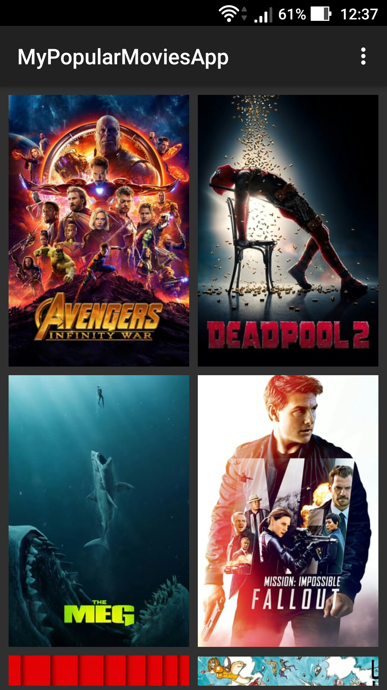
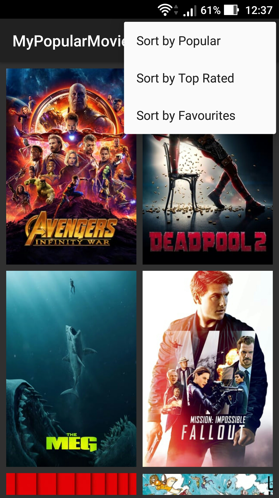
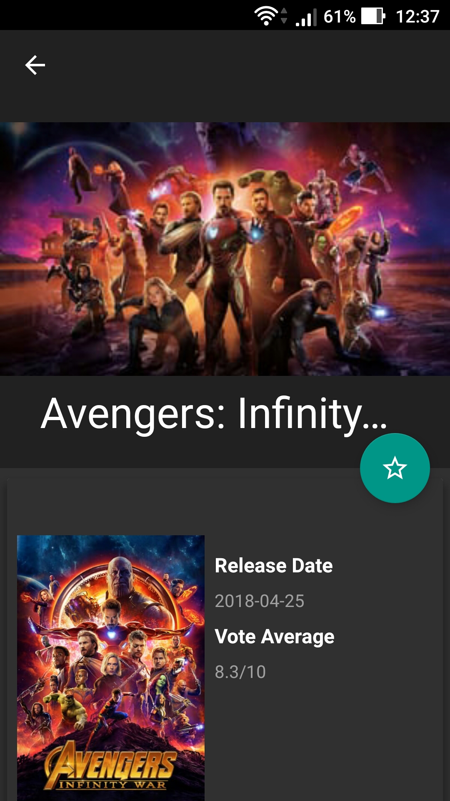
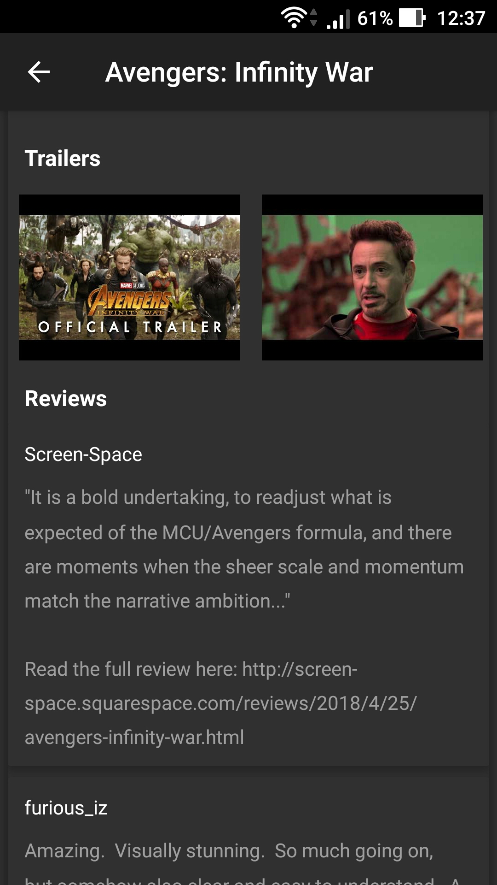
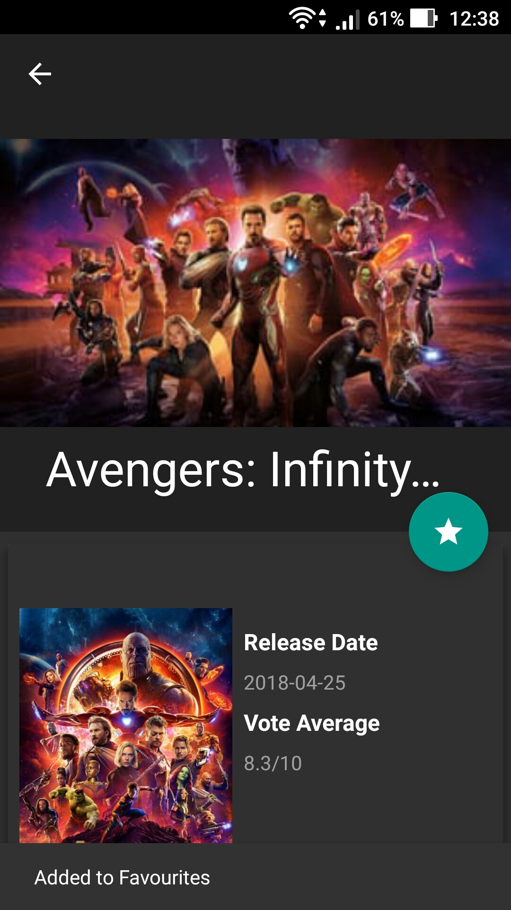
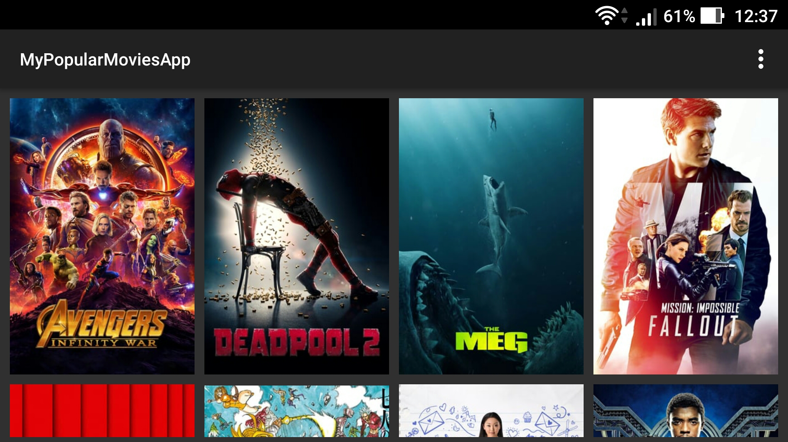
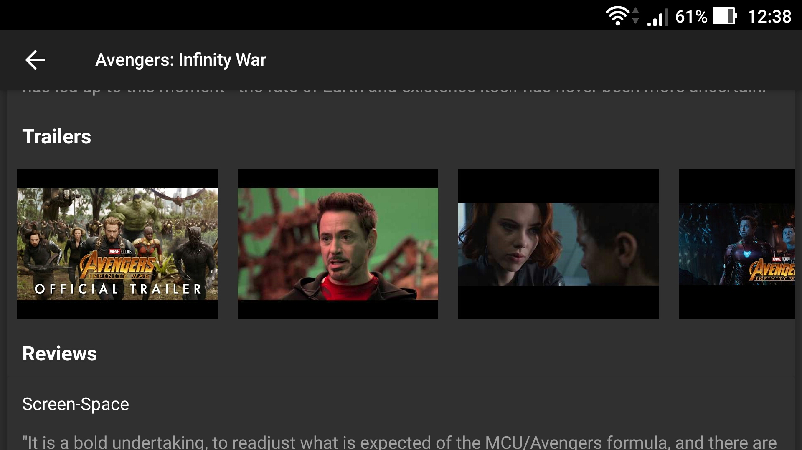

# Udacity-MyPopularMoviesApp-Stage2

It is the second project and stage 2 of Udacity Android Nanodegree Program.

To use write your themoviedb API key to gradle.properties

## ScreenShots

  
 

 
 
